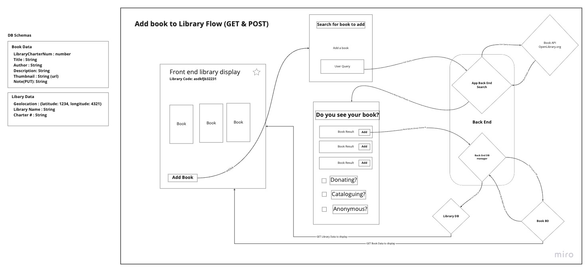
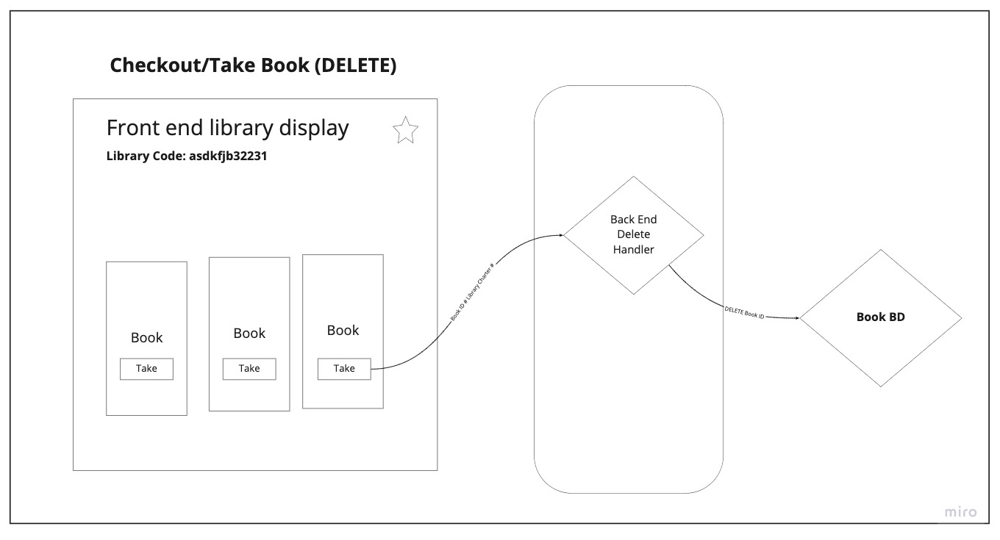
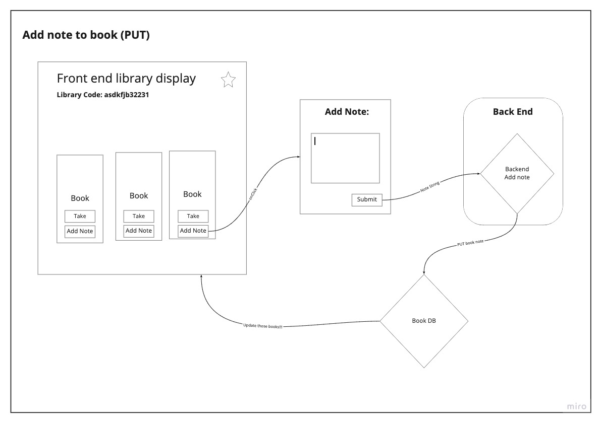

# Little Librarian Back-End

## Cooperation Plan

### Team key strengths?

* Steve is familiar with the material and has already presented a 301 project. Strength in css
* Joseph has an aptitude for reading documentation and strong in react
* Joey is strong in design and layout. Strength in css
* Chris is Persistent and has strong follow through
* Sam efficient and focused on task at hand

**How are we going to utilize these street?**

* Have Steve and Joey focus on the design part of the project
* Chris and Joey will be our power house of new code design

**What professional competencies do you want work on?**

1. Sam wants to work as a team manager.
2. Joey confidence and technical confidence.
3. Joseph collaboration.
4. Steve planning and time management, subject knowledge.
5. Chris wants to manage focus and staying agile.

### Day to day work schedule

* 9:00am to 6:00pm 12pm-2pm lunch designed but open to interpretation
* Morning standup to go over what is planned
* Afternoon will be bringing all the code together and planning for tomorrow

## Conflict Plan

* **Conflict Resolution**
  * One-on-one then, one and another group member, then move to a full group discussion, and then elevate as needed.

## Communication Plan

* **Availability**
  * Joey 10pm cutoff
  * Joseph 10pm
  * Steve communication always but delayed after hours
  * Chris 10pm
  * Sam 10pm
* **Communication Platforms?**
  * Slack
  * Remo
  * Zoom/Discord

### Breaks an off hours

* As needed but will have planned lunch
* If we start to fall behind?
  * Reevaluate what is MVP for us
* Communication on off hours
  * Slack

### Making sure to hear all voices

* Everyone will be sharing at stand up and stand down
* Frame responses with mutual respect.

## DEI

* Sam is going to make sure he already assumes
* Joe wants to check his bias
* Steve want to stay open to new ideas
* Joseph wants to find route cause and understanding
* Chris making sure we see each other as person

## Work Plan

* **Tools for collaboration and workflow**
  * We will be creating a task list to manage things from our trello board
  * LiveShare on VS code
* **Git Process**
  * Frontend and backend will live on the GitHub
  * Making a organization
  * Working on own branches
  * Push to staging and test
  * Otherwise push as needed
* **PR Processes**
  * Two other reviews for main
  * One for staging
  * Merging hopeful once a day but as necessary

**User Stories:**
[Trello Board](https://trello.com/b/0ab5BQlD/open-hand-data)

## Software Requirements

* What is the vision of this product?
  * The vision of the product is to catalog and display the books available at free little libraries around a community.
* What pain point does the project solve?
  * It increases awareness and access to these community resource, while allowing users to see what books they can expect in a free little library prior to travelling to one.
* Why should we care about your product?
  * These dispersed resources are available and the greater use will benefit all communities. As it is now, libraries can be found using littlefreelibrary.org but there is no way to know what you'll find when you get there.

### Project Scope (In/Out)

* **In Scope**
  * allow you to search for a book in the entire library system
  * show you what is in a specific library
  * Allow you to delete a book in a library
  * Allow you to add a note to the book
  * Allow you to add a book to a library
* **Out of Scope**
  * Not going to show a map of locations
  * Not going to add library locations

### Minimum Viable Product

* **What will your MVP functionality be?**
  * A user will be able add or remove a book from a library
  * A user will be able to search by a book or by library
  * A user will be able to leave a review on a book

### Stretch Goals

* **What are your stretch goals?**
  * Push in our seed data from littlefreelibrary.org
  * Allow for the creation of a new library
  * Allow for the User to have read book list/ inventory of books
* **What stretch goals are you going to aim for?**
  * Creation of a new library

### Functional Requirements

* A user will be able add or remove a book from a library
* A user will be able to search by a book or by library
* A user will be able to leave a review on a book

### Data Flow





### Non-Functional Requirements

* **Security**
  * Our app will use Auth0 to make sure we have authorized users
  * This will allow us to track and personalize to our users
  * Our backend will validate requests to make sure it is coming from our front end
  * Managing the uses of our api and databases so only our users are able to access those resources

* **Database**
  * Each item belongs to a single location
  * The two databases will be a Library Database and a Book Database
    * There will be a identifier in the Library that will have an associated data point in the Book
  * Each book is associated with only one library

**DB Schemas**

```js
Library = {
  geolocation : {
    latitude: Number, 
    longitude: Number
    },
  libraryName : String,
  charter : String
}

Book = {
  libraryCharterNum : String,
  title : String,
  author : String,
  description: String,
  thumbnail : String, //url
  note: String //optional
}
```
